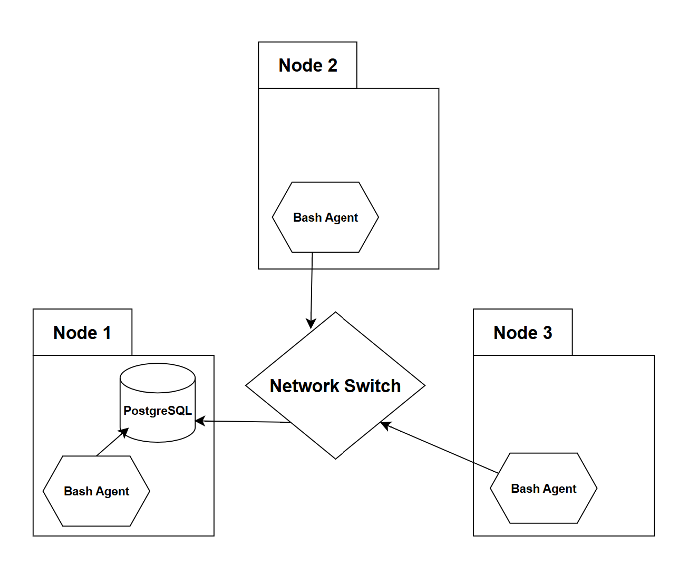

# Introduction
The Jarvis Linux Cluster Adminstration team manages multiple nodes running Rocky Linux 9. The team wants to store hardware information and real-time usage of resources for each node. This data will be utilized to generate reports that help in resource planning decisions.
This project is an MVP for automating the collection of the data required by the team, as described above.

### Technologies Used:
- Docker for running a PostgreSQL instance in a container
- Bash for writing scripts that interact with the PostgreSQL instance
- Crontab for scheduling a job that runs the usage data script `host_usage.sh` every minute

### Environment:

This project was made in a Jarvis Remote Desktop (JRD), which is a virtual desktop created through Google Cloud Platform. The JRD runs Rocky Linux 9 and utilizes the [VNC architecture](https://discover.realvnc.com/what-is-vnc-remote-access-technology).

# Quick Start
- Start a postgres instance using `psql_docker.sh`

  ```
  # Arguments: <COMMAND> <PSQL_USER> <PSQL_PASSWORD>
  ./scripts/psql_docker.sh create postgres password
  ```
- Create tables using `ddl.sql`

  ```
  # Arguments: None
  ./sql/ddl.sql
  ```
- Insert hardware specs data into the DB using `host_info.sh`

  ```
  # Arguments: <PSQL_HOST> <PSQL_PORT> <DB_NAME> <PSQL_USER> <PSQL_PASSWORD>
  ./scripts/host_info.sh "localhost" 5432 "host_agent" "postgres" "password"
  ```
- Insert hardware usage data into the DB using `host_usage.sh`

  ```
  # Arguments: <PSQL_HOST> <PSQL_PORT> <DB_NAME> <PSQL_USER> <PSQL_PASSWORD>
  ./scripts/host_usage.sh "localhost" 5432 "host_agent" "postgres" "password"
  ```
- Crontab setup

  ```
  # Go to the scripts directory
  cd scripts
  
  # Copy the current working directory path
  pwd
  
  # Edit crontab file
  crontab -e
  
  # Add the following job to crontab
  # Replace <PWD> with the path to the working directory, copied previously
  * * * * * bash <PWD> "localhost" 5432 "host_agent" "postgres" "password" &> /tmp/host_usage.log
  ```

# Implemenation
This project was implemented in five major steps:
1. Create `psql_docker.sh` to create/start/stop a Docker container that runs a postgres instance.
2. Create `ddl.sql` to create `host_info` and `host_usage` tables in the `host_agent` database.
   Note: It is assumed that the `host_agent` database already exists.
4. Create `host_info.sh` to collect the host hardware data and insert it into the database.
5. Create `host_usage.sh` to collect the host resource usage data and insert it into the database.
6. Set up a crontab job that gets triggered every minute. This job executes `host_usage.sh` to keep the host resource usage data updated.

## Architecture


The diagram above describes a Linux cluster of three nodes which are connected through a network switch. A PostgreSQL resides in one node to store all the data. Each node has the same bash agent.
The bash agent consists of two scripts: `host_info.sh` and `host_usage.sh`
- `host_info.sh` collects the hardware data of the node and inserts it into the database. Runs once when installed.
- `host_usage.sh` collects the resource usage data and inserts it into the database. Runs every minute through a scheduled crontab job.

## Scripts
- `psql_docker.sh` handles starting a postgres instance and provides three possible commands:
    - create: to create and start a Docker container that runs a postgres instance. It requires a username and password.
    - start: to start the created Docker container.
    - stop: to stop the created Docker container.

  Usage:
  ```
  # ./scripts/psql_docker.sh create <PSQL_USER> <PSQL_PASSWORD>
  # Example
  ./scripts/psql_docker.sh create postgres password
  
  ./scripts/psql_docker.sh start
  ./scripts/psql_docker.sh stop
  ```
- `host_info.sh` handles collecting hardware data and inserting it into the postgres instance running on docker. It requires the postgres host, port, database name, username, and password.

  Usage:
  ```
  # ./scripts/host_info.sh <PSQL_HOST> <PSQL_PORT> <DB_NAME> <PSQL_USER> <PSQL_PASSWORD>
  # Example
  ./scripts/host_info.sh "localhost" 5432 "host_agent" "postgres" "password"
  ```
- `host_usage.sh` handles collecting resource usage data and inserting it into the postgres instance running on docker. It requires the postgres host, port, database name, username, and password.

  Usage:
  ```
  # ./scripts/host_usage.sh <PSQL_HOST> <PSQL_PORT> <DB_NAME> <PSQL_USER> <PSQL_PASSWORD>
  # Example
  ./scripts/host_usage.sh "localhost" 5432 "host_agent" "postgres" "password"
  ```
- Crontab schedules a job that runs the usage data script `host_usage.sh` every interval of time. For example, every minute.

  Usage:
  ```
  # Go to the scripts directory
  cd scripts
  
  # Copy the current working directory path
  pwd
  
  # Edit crontab file
  crontab -e
  
  # Add the job to crontab
  
  # The example job below runs every minute and redirects the output into a log file
  # Replace <PWD> with the path to the working directory, copied previously
  * * * * * bash <PWD> "localhost" 5432 "host_agent" "postgres" "password" &> /tmp/host_usage.log
  ```

## Database Modeling
There are two tables in the database: `host_info` and `host_usage`
- `host_info`

  | Column Name      | Data Type     | Constraints         | Description                       |
  |-------------------|--------------|---------------------|-----------------------------------|
  | id               | SERIAL        | Primary Key, Not Null | Unique identifier for each host |
  | hostname         | VARCHAR       | Unique, Not Null    | Fully qualified hostname          |
  | cpu_number       | INT2          | Not Null            | Number of CPU cores               |
  | cpu_architecture | VARCHAR       | Not Null            | CPU Architecture                  |
  | cpu_model        | VARCHAR       | Not Null            | CPU Model                         |
  | cpu_mhz          | FLOAT8        | Not Null            | CPU clock speed in MHz            |
  | l2_cache         | INT4          | Not Null            | Size of the L2 cache in kB        |
  | timestamp        | TIMESTAMP     | Nullable            | Timestamp in UTC timezone         |
  | total_mem        | INT4          | Nullable            | Total memory in MB                |

- `host_usage`

  | Column Name      | Data Type     | Constraints                 | Description                                |
  |------------------|---------------|-----------------------------|--------------------------------------------|
  | timestamp        | TIMESTAMP     | Not Null                    | Timestamp in UTC timezone                  |
  | host_id          | SERIAL        | Not Null, Foreign Key       | References the `id` from `host_info` table |
  | memory_free      | INT4          | Not Null                    | Amount of free memory in MB                |
  | cpu_idle         | INT2          | Not Null                    | Percentage of CPU idle time.               |
  | cpu_kernel       | INT2          | Not Null                    | Percentage of CPU running kernel code      |
  | disk_io          | INT4          | Not Null                    | Disk IO                                    |
  | disk_available   | INT4          | Not Null                    | Amount of available disk in MB             |


# Test
Since this project is an MVP, the testing was done manually on the JRD.
After running each script and SQL code, the result was verified in the PostgreSQL database through SQL queries.

# Deployment
- Github was used to host the source code.
- Crontab was used to schedule a job that runs the usage data script `host_usage.sh` every minute.
- Docker was used for running a PostgreSQL instance in a container.

# Improvements
Below are some possible improvements for this project.
- Add a help command in all of the bash scripts. This way, it is easier to know the required arguments to execute a script. Check the example below.

  ```
  ./scripts/psql_docker.sh help
  # Sample output
  This script has the following commands
  - create: to create and start a Docker container that runs a postgres instance.
  Arguments required: <PSQL_USER> <PSQL_PASSWORD>
  - start: to start the created Docker container.
  - stop: to stop the created Docker container.
  - help: to output a guide for the commands available.
  ```
- Add a command that removes the container in the `psql_docker.sh` script. This way, the script is more self-sufficient. Check the example below.

  ```
  ./scripts/psql_docker.sh remove
  ```
- Add more input validation in all of the bash scripts. Currently, the bash scripts check whether the number of arguments is correct. Taking this to the next step, identifying invalid arguments would make the required arguments more clear and avoid potential unwanted database insertions. Check the example below.

  ```
  ./scripts/host_info.sh "localhost" 5432 123 "postgres" "password"
  # Sample output
  ERROR: <DB_NAME> must be a string, but an integer value of 123 was given.
  ```
